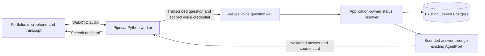

# Talk to Jeeves: portfolio voice assistant

Date: 2026-09-19. Status: proposed design, not implemented.

## Selected LLM

User selected **GPT-5.6 Luna** (`gpt-5.6-luna`) for voice question interpretation and grounded explanation on 2026-09-19. Give voice its own model selection through the application-owned AgentPort; existing governance review model settings remain independent. Validate structured outputs, record resolution, factual accuracy, and response latency before live adoption.

GPT-4o Mini Transcribe and GPT-4o Mini TTS remain the proposed speech input/output models. This records the LLM decision; implementation, provider setup, and deployment are still pending.

## Experience

Add a **Talk to Jeeves** button to the portfolio. A small panel provides Start, Mute, End call, a visible transcript, a text-input fallback, and a linked submission card. Start explicitly requests microphone access. Display listening, checking records, speaking, disconnected, and error states. Keep the synthetic-demo label visible and identify the speaker as an AI assistant at the start.

The initial scope assumes a browser call. A question about browser versus telephone access is pending; this assumption does not authorize a phone number or hosting purchase.

Supported questions:

- What does Jeeves do, and how does its review process work?
- What is happening with this submission?
- Which reviews have been signed, and which remain open?
- What information is missing? What should happen next?
- Why is this initiative paused, according to its recorded events?
- What in the portfolio needs attention?

Illustrative conversation, not a report of current records:

> User: What is happening with submission number one?
>
> Jeeves: Do you mean the prior-auth summarizer?
>
> User: Yes.
>
> Jeeves: It is in review. Six of eight required reviews are signed. Privacy and Security remain open. I do not see a recorded completion date. The submission card shows the review details.

Follow-ups such as "Who is handling that?" retain the confirmed submission context. Each status answer fetches fresh data. The answer starts with the status, then gives the recorded blocker and next step in two or three short sentences. The card contains the longer detail, source links, and check time.

## Current foundation and gaps

Source inspection covered the dirty `claude/monetization-m1` checkout at `88fe562` and selected files at cached `origin/main` `8c7c0a0`. No remote refresh, application execution, database query, or hosted verification was performed. Implementation must recheck the then-current main and use an isolated worktree; unrelated dirty work is outside this proposal.

- `components/jeeves/portfolio-view.tsx` supplies saved views and the initiative table. `app/(console)/portfolio/page.tsx` provides a straightforward place for the new panel.
- `lib/data/provider.ts` already exposes workspace-scoped initiative lists and details. Explicit scope is mandatory: omitting options can return all workspaces.
- `lib/data/dto.ts` exposes lifecycle state, review counts, intake gaps, reviews, decisions, controls, deployments, and event history. These are the initial answer sources.
- `app/api/chat/auditor/route.ts` already gates model calls and supplies grounding. Its canned-query/slug heuristic is insufficient for the proposed experience: unmatched questions can fall back to an unrelated audit query. Do not wrap that endpoint unchanged with speech.
- IDs and slugs exist, but there is no universal user-facing sequential submission number. A table row's position is unstable under sorting and filtering.
- Review details currently omit some structured information, including return reasons and stable review/event IDs. A reviewer name is not proof of an accepted task assignment. The proposed workflow-continuity document does not itself implement ownership, escalation, deadlines, or recovery.

For v1, resolve a selected record, exact visible ID, or unique visible title/slug. Ask for clarification when a number or partial title is ambiguous. Never silently map "one" to the first row or to a similarly numbered seed. Do not add a numbering migration just for voice.

## Architecture

Pipecat handles speech input, turn detection, interruptions, speech output, and media connection lifecycle. A custom processor calls Jeeves after a completed user turn. Jeeves retains its AI SDK/AgentPort boundary, authentication, retrieval, and authoritative business rules. The Python process receives no database credential or workflow mutation capability. It does not introduce another general-purpose LLM agent.

This bridge is a proposed application design supported by Pipecat's [custom processor interface](https://docs.pipecat.ai/pipecat/fundamentals/custom-frame-processor); its interruption and streaming behavior must be tested. Pipecat also supports [function calling](https://docs.pipecat.ai/pipecat/learn/function-calling), but the first version keeps information access inside Jeeves.

Keep the website and application API in the existing hosting setup. Run the voice worker as a separate Python service. Pipecat documents the [bot process and session-start hosting model](https://docs.pipecat.ai/pipecat/deployment/overview). Use SmallWebRTC for the local prototype; evaluate Pipecat Cloud with Daily for a hosted demo, following the [transport guidance](https://docs.pipecat.ai/client/concepts/choosing-a-transport). Hosted service selection and spend remain unapproved.

## Answer contract

Expose only four application operations: resolve an accessible submission, read its status, summarize the accessible portfolio, and explain approved Jeeves help content. Each operation has bounded typed input and output. No arbitrary SQL, URL fetching, or model-supplied workspace scope.

The question API returns:

- `result`: answer, clarify, not_found, unavailable, or out_of_scope.
- `speechText`: short validated plain text.
- `submission`: confirmed ID, title, and an application-generated detail link, if relevant.
- `facts`: state, required/signed review counts, outstanding domains, intake gaps, recorded conditions or incidents, and applicable next step.
- `sources`: allowlisted application links to the source sections, with source timestamps where present.
- `checkedAt`: when records were retrieved; separate from state-change time and individual evidence/event timestamps.
- `unknowns`: absent reasons, owners, deadlines, or evidence.

Use server-authored factual status sentences or structured facts that a deterministic formatter validates. A model can interpret a question and provide a bounded explanation; it cannot supply an unverified status, owner, date, approval, or citation. Approved help text supplies general process explanations. Treat submission text and evidence as data, including any embedded instructions.

Use detail-page/section links until stable event links actually exist. Do not invent event anchors. Report lifecycle state, review signature, initiative decision, and deployment state separately: signed reviews do not by themselves mean approval or deployment. Select the relevant current review cycle and distinguish older decisions from current reassessment.

If a reason is absent from the returned data, say so. Do not infer a guaranteed deadline from elapsed queue age, an owner from a job title, or a recovery action from the existence of a plan. A failed read produces an unavailable response, never a cached answer presented as current. Re-fetch for status follow-ups and reject late results from interrupted turns.

Project only allowlisted facts from the scoped provider; never send the full `InitiativeDetail` or raw intake/evidence to Python or the model. Interpret gaps using application completeness rules for the current stage: for example, `data.retentionIntent` can be missing without blocking initial submission, while blocking later review assignment. Do not equate every gap with a submit blocker. Demo scripts can drift from seed/current records and are not status authority.

## Access and cost boundaries

Live voice uses the existing demo passcode/session gate even though its business operations are read-only. Public seeded browsing remains available under its existing rules. No anonymous provider-backed voice in this scope.

The session-start route verifies the original session, atomically reserves only the audio/worker allowance in the voice-session ledger, and creates a short-lived voice-only credential for the worker. It is tied to the original session, workspace, room/call identity, expiry, and allowed read operations. The browser receives only the transport credentials it needs. Revalidate the original session and resource visibility on every question. Validate the startup origin and reject arbitrary service callback URLs.

Existing logout/persona switching does not revoke old database sessions. Add an explicit voice-session revoke operation and a client hook on logout or session/token change: stop local media immediately, clear conversation context, persist revocation, and stop the worker. Every question checks that revocation state. Use a short renewable call lease so a lost revoke request or disconnected client cannot leave the worker running indefinitely; server termination is confirmed on revoke acknowledgement or lease expiry. Parent-session expiry independently invalidates the delegation.

The existing `runMutationGuard` cannot directly accept this delegated credential. Add a narrow voice guard that resolves it server-side to the parent session, rejects a null/missing workspace, and composes the existing rate, input, and budget checks. Never trust a workspace supplied in the question body or by the worker.

Use a persisted voice-session record for expiry, cancellation, reservations, and concurrent-start protection. Startup retries use an idempotency key and must not launch duplicate bots. No broad Jeeves bearer credential in Python, model prompts, URLs, or logs. Keep provider keys server-side.

Proposed initial limits: one active call per demo session, a three-minute maximum, 30 seconds of idle time, 20 user turns, 2,000 characters per question, and bounded answer/context sizes. Enforce these on the server/worker, including on disconnect and restart; expired sessions cannot resume spending.

Every model invocation, including interpretation and any retry, must pass the atomic `run_budget` reservation with an enforced maximum context/output envelope. The existing 800-token auditor estimate is not a sufficient voice-session allowance. Separately reserve/enforce an audio-duration and speech-output allowance: model tokens do not pay for or cap STT, TTS, transport, or worker time. Startup reserves audio/worker capacity; per-turn reservation accounts for model tokens. Do not charge the same model allowance at both startup and turn execution. Set provider spending limits before a hosted demo. Budget/session accounting are the only new writes; voice exposes no business mutation tools.

Disable application audio recording and persistent transcript storage by default. Keep transient context minimal and clear it at call end. Before real provider testing, disclose the speech providers and check their retention settings; application recording-off is not a provider-retention guarantee. Use only fictional Meridian Health examples.

## Bounded implementation plan, pending GO

1. `components/jeeves/voice-assistant.tsx` (new), `app/(console)/portfolio/page.tsx`, and a narrow hook in `lib/client/session-context.tsx`: add the accessible Talk panel, transcript, typed fallback, context selection, source cards, and voice revocation on logout/session changes. Integrate Pipecat's React client. Validate all selected record context server-side.
2. `lib/services/voice-status-service.ts` and its test (new), `lib/voice/contracts.ts` and `lib/voice/help.ts` (new): implement scoped reference resolution, typed answers, facts/unknowns, approved help, and deterministic next-step wording.
3. `lib/agents/ports.ts`, `schemas.ts`, `openai-adapter.ts`, `mock-adapter.ts`, with focused existing/new tests: add only the bounded interpretation/explanation capability needed for voice. Use the existing adapter selection. All model calls mocked in tests.
4. `app/api/voice/session/route.ts`, `app/api/voice/ask/route.ts`, `lib/services/voice-session-service.ts`, and `lib/security/voice-access.ts` (new): implement session start/revoke/lease renewal, delegated access, validation, cancellation, rate limits, and budget reservation. Reuse existing guard/session/budget primitives without weakening their checks.
5. `lib/db/schema.ts`, one new migration and its metadata: add the small voice-session/reservation record. Keep all existing domain records unchanged. Validate migration scope separately before any database execution.
6. `voice/bot.py`, `voice/jeeves_processor.py`, `voice/pyproject.toml`, a Python lockfile, and focused processor tests (new): add the speech pipeline and cancellable HTTP bridge. `package.json` and `package-lock.json`: add the reviewed Pipecat browser dependencies. Review exact versions and installation scripts before installation.
7. `tests/ui/voice-assistant.test.tsx`, `app/api/voice/__tests__/routes.test.ts`, `tests/e2e/voice-status.spec.ts` (new): verify the scoped experience, access controls, and failures. Preserve the existing golden path.
8. `docs/VOICE-BOT-DESIGN-2026-09-19.md`, `docs/deploy.md`, `agents-build-log.md`: document verified setup and limitations. Exact environment/hosting changes require their own reviewed scope; do not edit `.env` or provision anything under a generic code GO.

Use failing behavior tests first, implement the smallest passing path, run the relevant suites, and obtain independent review against the chosen main baseline. No commit, merge, deployment, provider purchase, or live call is implied by this design.

## Acceptance checks

- Correct answers for draft, submitted, triaged, in review, returned review, conditional approval, deployed, paused/reassessment, rejected, and retired cases; unknowns remain explicit.
- A selected record, ambiguous number, duplicate/partial title, missing record, and speech misrecognition never silently resolve to the wrong initiative.
- Foreign-workspace records cannot appear in search candidates, answers, counts, source cards, or conversation history. Missing scope fails closed. Malformed or expired credentials and direct worker access cannot bypass the session gate.
- Status read after a change is refreshed. Old decisions and signatures cannot be reported as a current approval. Unknown return reasons/owners/deadlines are not invented.
- Concurrent start/retry, original-session expiry, explicit voice revocation on logout/persona switch, lost revoke requests and lease expiry, budget exhaustion, timeouts, disconnects, malicious evidence, and requests to approve or change status are handled correctly. Replaying an old delegation after revocation fails even while the old parent database session is otherwise unexpired.
- Microphone denial, text-only use, keyboard controls, mobile layout, interruptions, End call, and late responses behave predictably.
- Automated LLM/STT/TTS and transport tests use mocks. Run relevant Vitest suites, typecheck, lint, Python processor tests, the voice Playwright path and the existing golden path. Run available scoped security checks and inspect the new dependency/migration diff.
- A separately authorized real microphone session verifies intelligibility, timing, interruption, and shutdown on an actual browser. Measure first-audio latency and correctness on a scripted set of questions; automated text checks alone do not establish voice quality or hosted readiness.

## Optional telephone follow-on

Pipecat supports incoming phone calls through [Twilio Media Streams](https://docs.pipecat.ai/pipecat/telephony/twilio-websockets). That version adds a phone number, verified webhooks, caller authentication linked to a Jeeves session/workspace, and telephony charges. Caller ID alone must not authorize submission access. Reuse the same question API after authentication. Telephone provisioning and calling are outside the initial browser proposal.
